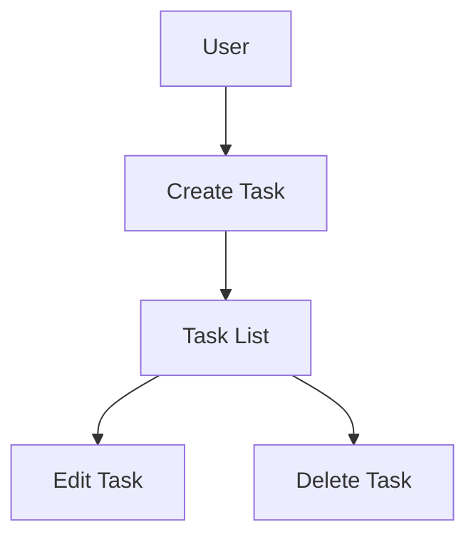

# CLAUDE.md

## Overview
Defines standard rules to follow during development.

## Project Structure

This repository is dedicated to a task management application.

### Document Classification

#### 1. Persistent Documents (`docs/`)

Permanent documents defining **what to build** and **how to build** for the entire application.
Updated only when fundamental design or policies change.

- **product-requirements.md** - Product Requirements Document
  - Product vision and purpose
  - Target users, problems, and needs
  - Key feature list
  - Success criteria
  - Business requirements
  - User stories
  - Acceptance criteria
  - Functional/Non-functional requirements

- **functional-design.md** - Functional Design Document
  - Feature-specific architecture
  - System diagrams
  - Data model definitions (including ER diagrams)
  - Component design
  - Use case diagrams, screen transitions, wireframes
  - API design (for future backend integration)

- **architecture.md** - Technical Specification
  - Technology stack
  - Development tools and methodologies
  - Technical constraints and requirements
  - Performance requirements

- **repository-structure.md** - Repository Structure Definition
  - Folder/file structure
  - Directory roles
  - File placement rules

- **development-guidelines.md** - Development Guidelines
  - Coding standards
  - Naming conventions
  - Styling standards
  - Testing standards
  - Git conventions

- **glossary.md** - Ubiquitous Language Definition
  - Domain terminology
  - Business terminology
  - UI/UX terminology
  - English-Japanese mapping
  - Code naming conventions

#### 2. Work-Unit Documents (`.steering/[YYYYMMDD]-[No]-[dev-title]/`)

Temporary steering files defining **what to do this time** for specific development work.
Retained for reference after completion; new work creates new directories.

- **requirements.md** - Current work requirements
  - Feature changes/additions description
  - User stories
  - Acceptance criteria
  - Constraints

- **design.md** - Change design
  - Implementation approach
  - Components to modify
  - Data structure changes
  - Impact analysis

- **tasklist.md** - Task list
  - Specific implementation tasks
  - Progress status
  - Completion criteria

### Steering Directory Naming Convention

```
.steering/[YYYYMMDD]-[No]-[dev-title]/
```

**Format:**
- `YYYYMMDD`: 作成日: (JST)
- `No`: 同一日付内での連番（2桁ゼロ埋め: 01, 02, 03...）
- `dev-title`: 開発タスクの説明

**Examples:**
- `.steering/20250103-01-initial-implementation/`
- `.steering/20250115-01-add-tag-feature/`
- `.steering/20250115-02-fix-filter-bug/`
- `.steering/20250201-01-improve-performance/`

## Development Process

### Initial Setup Procedure

#### 1. Create Folders
```bash
mkdir -p docs
mkdir -p .steering
```

#### 2. Create Persistent Documents (`docs/`)

Define overall application design.
Get confirmation/approval after each document before proceeding.

1. `docs/product-requirements.md` - Product Requirements
2. `docs/functional-design.md` - Functional Design
3. `docs/architecture.md` - Technical Specification
4. `docs/repository-structure.md` - Repository Structure
5. `docs/development-guidelines.md` - Development Guidelines
6. `docs/glossary.md` - Ubiquitous Language

**Important:** Get confirmation/approval after creating each file before proceeding to the next.

#### 3. Create Initial Implementation Steering Files

Create directory for initial implementation with required documents.

```bash
mkdir -p .steering/[YYYYMMDD]-01-initial-implementation
```

Documents to create:
1. `.steering/[YYYYMMDD]-01-initial-implementation/requirements.md` - Initial requirements
2. `.steering/[YYYYMMDD]-01-initial-implementation/design.md` - Implementation design
3. `.steering/[YYYYMMDD]-01-initial-implementation/tasklist.md` - Implementation tasks

#### 4. Environment Setup

#### 5. Start Implementation

Proceed based on `.steering/[YYYYMMDD]-01-initial-implementation/tasklist.md`.

#### 6. Quality Check

### Feature Addition/Modification Procedure

#### 1. Impact Analysis

- Check impact on persistent documents (`docs/`)
- Update `docs/` if changes affect fundamental design

#### 2. Create Steering Directory

Create new directory for the work.

```bash
mkdir -p .steering/[YYYYMMDD]-[No]-[dev-title]
```

**Example:**
```bash
mkdir -p .steering/20250115-01-add-tag-feature
```

#### 3. Create Work Documents

Create work-unit documents.
Get confirmation/approval after each document before proceeding.

1. `.steering/[YYYYMMDD]-[No]-[dev-title]/requirements.md` - Requirements
2. `.steering/[YYYYMMDD]-[No]-[dev-title]/design.md` - Design
3. `.steering/[YYYYMMDD]-[No]-[dev-title]/tasklist.md` - Task list

**Important:** Get confirmation/approval after creating each file before proceeding to the next.

#### 4. Update Persistent Documents (if needed)

Update relevant `docs/` documents if changes affect fundamental design.

#### 5. Start Implementation

Proceed based on `.steering/[YYYYMMDD]-[No]-[dev-title]/tasklist.md`.

#### 6. Quality Check

## Document Management Principles

### Persistent Documents (`docs/`)
- Describe fundamental application design
- Infrequently updated
- Updated only for major design changes
- Serve as the project's "North Star"

### Work-Unit Documents (`.steering/`)
- Focused on specific work/changes
- New directory for each work item
- Retained as history after completion
- Record change intent and context

## Diagrams and Charts Rules

### Location
Include diagrams directly in related persistent documents.
Do not create separate diagrams folder; minimize maintenance overhead.

**Placement examples:**
- ER diagrams, data model diagrams → in `functional-design.md`
- Use case diagrams → in `functional-design.md` or `product-requirements.md`
- Screen transitions, wireframes → in `functional-design.md`
- System architecture diagrams → in `functional-design.md` or `architecture.md`

### Format
1. **Mermaid notation (recommended)**
   - Embeddable directly in Markdown
   - Easy version control
   - Editable without special tools



2. **ASCII Art**
   - For simple diagrams
   - Editable in any text editor

```
┌─────────────┐
│   Header    │
└─────────────┘
       │
       ↓
┌─────────────┐
│  Task List  │
└─────────────┘
```

3. **Image files (only when necessary)**
   - Complex wireframes or mockups
   - Place in `docs/images/`
   - PNG or SVG format recommended

### Diagram Updates
- Update diagrams simultaneously with design changes
- Prevent divergence between diagrams and code

## Test Accounts

動作確認用のテストアカウント:

| 用途 | Email | Password |
|------|-------|----------|
| 開発テスト | test@example.com | testpassword123 |

## Notes

- Create/update documents incrementally; get approval at each stage
- `.steering/` directory names should clearly identify date, sequence number, and development title
- Do not confuse persistent and work-unit documents
- Always run lint and type checks after code changes
- Use common design system (Tailwind CSS) for consistency
- Security-conscious coding (XSS prevention, input validation, etc.)
- Keep diagrams minimal to reduce maintenance cost
